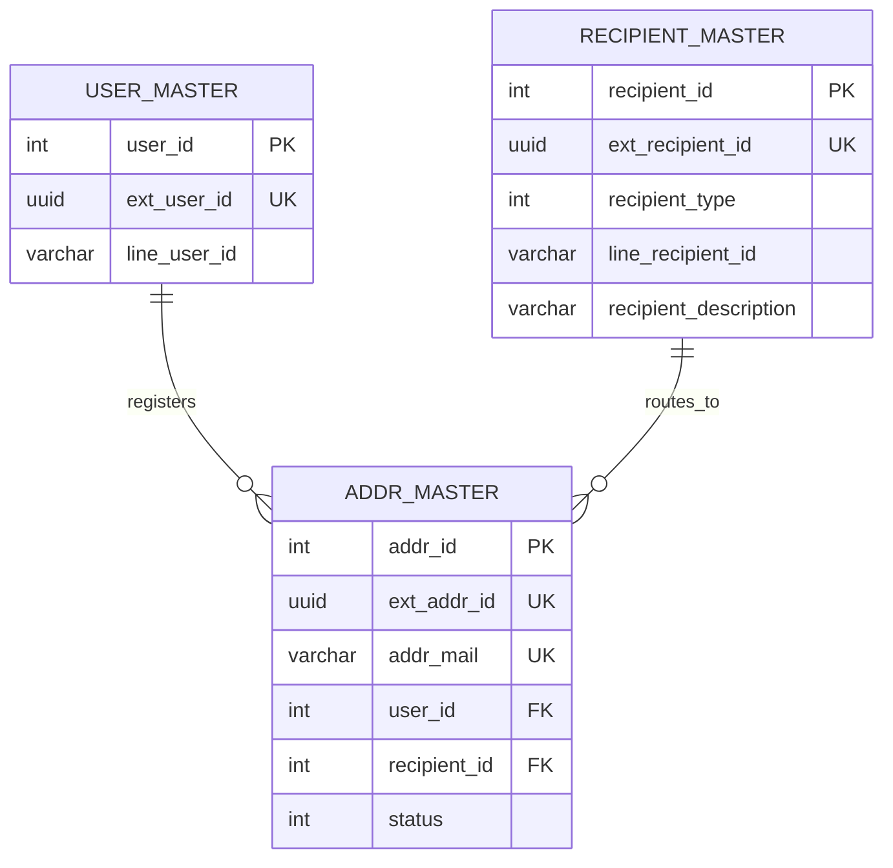

# データモデル

## テーブル一覧

- user_master: LINE ログイン済みユーザー
- recipient_master: LINE 送信先
- addr_master: メールアドレスローカルパートと送信先の対応

## ER 図



## user_master

| カラム | 型 | 意味 |
| --- | --- | --- |
| user_id | INTEGER | 内部主キー |
| ext_user_id | UUID | 外部公開用ユーザー ID |
| line_user_id | VARCHAR(33) | LINE ユーザー ID |

### 制約

- PRIMARY KEY: user_id
- UNIQUE: ext_user_id

### 役割

- セッションに保持するユーザー識別子の元データ
- addr_master.user_id の参照先

## recipient_master

| カラム | 型 | 意味 |
| --- | --- | --- |
| recipient_id | INTEGER | 内部主キー |
| ext_recipient_id | UUID | 外部公開用送信先 ID |
| recipient_type | INTEGER | 送信先種別 |
| line_recipient_id | VARCHAR(33) | LINE のユーザー ID またはグループ ID |
| recipient_description | VARCHAR(64) | 画面表示名 |

### recipient_type の意味

- 0: ユーザー本人への 1:1 宛先
- 1: グループ宛先

### 制約

- PRIMARY KEY: recipient_id
- UNIQUE: ext_recipient_id

### 役割

- LINE Messaging API の pushMessage 先を保持する
- ユーザー自身の宛先もグループ宛先も同じテーブルで扱う

## addr_master

| カラム | 型 | 意味 |
| --- | --- | --- |
| addr_id | INTEGER | 内部主キー |
| ext_addr_id | UUID | 外部公開用アドレス ID |
| addr_mail | VARCHAR(64) | メールアドレスのローカルパート |
| user_id | INTEGER | 登録ユーザー |
| recipient_id | INTEGER | 通知先 |
| status | INTEGER | 有効状態 |

### status の意味

- 1: 有効
- 0: 無効

実装上、API から新規登録されたアドレスは status=1 で保存される。

### 制約

- PRIMARY KEY: addr_id
- UNIQUE: addr_mail
- UNIQUE: ext_addr_id
- FOREIGN KEY: user_id -> user_master.user_id
- FOREIGN KEY: recipient_id -> recipient_master.recipient_id

## リレーション

```text
user_master (1) --- (N) addr_master (N) --- (1) recipient_master
```

意味としては、1 ユーザーが複数のメール受信用ローカルパートを持てて、それぞれが 1 つの LINE 送信先へ紐づく。

## 初期データ

DDL では以下を投入する。

- user_master にダミーユーザー 1 件
- recipient_master にダミー送信先 1 件
- addr_master に default と RFC 2142 系の予約語、OS 管理者系の予約語

### 予約済みローカルパート

- info
- marketing
- sales
- support
- abuse
- noc
- security
- postmaster
- hostmaster
- usenet
- news
- webmaster
- www
- uucp
- ftp
- root
- toor
- admin
- administrator

これらは status=0 で作られるため、通常配送には使われない。

## アプリコードとの対応

### user_master を使う処理

- addUser
- getUserByLineUserId
- getUserByExtUserId

### recipient_master を使う処理

- addRecipient
- getRecipientByLineRecipientId
- getRecipientAll
- getEnabledRecipientByEmail
- getEnabledRecipientByExtUserId

### addr_master を使う処理

- addAddr
- getAddrByEmail
- getAddrByExtAddrId
- delAddr
- enableAddr
- disableAddr
- getRegisteredAddrByExtUserId

## クエリ設計の特徴

- 一部取得は any を使い、件数をアプリ側で検証している
- JOIN は明示的な JOIN とカンマ区切りの旧式構文が混在している
- 外部公開 ID は UUID で、API では基本的にこちらを返している
