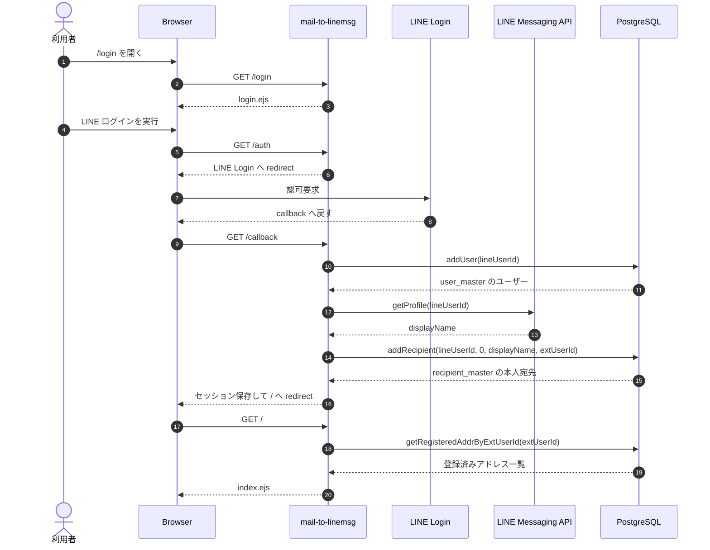
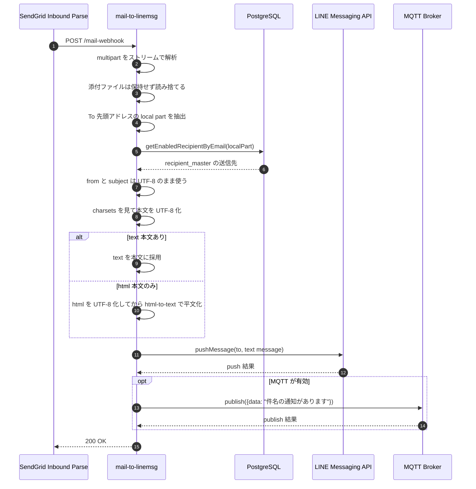

# システム概要

## 構成

アプリは Express ベースの単一プロセス構成で、主に次の責務を持つ。

- LINE ログインによる利用者認証
- LINE Messaging API Webhook 受信
- SendGrid Inbound Mail Webhook 受信
- PostgreSQL 上のユーザー、送信先、メールアドレス対応の管理
- 受信メールの LINE 送信と MQTT publish
- ブラウザ UI からのメールアドレス対応管理

## 主要コンポーネント

### index.js

アプリ本体。Express の初期化、セッション管理、各ルート定義、LINE/MQTT/DB 連携を担当する。

### db-pgsql.js

pg-promise を使ったデータアクセス層。次の操作をまとめている。

- ユーザー作成・取得
- LINE 送信先作成・取得
- メールアドレス対応作成・取得・削除
- 配送可能な送信先一覧の算出

### mqtt-publish.js

MQTT ブローカーに接続し、件名ベースの通知を JSON で publish する。

### public/main.js

フロント側の管理 UI を組み立てる。既存マッピングの一覧表示、追加、削除を REST API 経由で行う。

## シーケンス図

### LINE ログインから初期登録まで

### 受信メールから LINE と MQTT 通知まで

## リクエスト処理の流れ

### 1. ログインと初回利用

1. 利用者が /login を開く
2. /auth から LINE Login へ遷移する
3. /callback で id token を受け取る
4. user_master に LINE ユーザーを登録または再利用する
5. ユーザー本人向けの recipient を recipient_master に登録または再利用する
6. セッションに ext_user_id を保存する

この ext_user_id がアプリ内の認証済みユーザー識別子になる。

### 2. グループ送信先の登録

1. LINE Bot がグループへ招待される
2. /msg-webhook に join イベントが届く
3. グループ ID とグループ名を使って recipient_master へ登録する

この時点では誰の送信先かは固定されず、後続の API で実際に利用可能かどうかを判定する。

### 3. メールアドレス対応の登録

1. ログイン済み画面からローカルパートを入力する
2. 送信先候補から 1 件選ぶ
3. /api/addr へ POST する
4. addr_master に、ユーザーと送信先の組み合わせを保存する

保存対象は local@domain ではなく local 部分のみ。

### 4. メール受信から通知まで

1. SendGrid が /mail-webhook へ multipart/form-data で POST する
2. multipart をストリームで読み、必要な part だけ取り出す
3. To ヘッダー先頭アドレスのローカルパートを取り出す
4. addr_master から有効な recipient を 1 件引く
5. from と subject は SendGrid が正規化した UTF-8 値をそのまま使う
6. 添付ファイルは保持せず読み捨て、text か html の raw bytes だけを収集し、transfer-encoding をデコードしてから charsets に従って UTF-8 へ変換する
7. html のみなら UTF-8 化した後で text 化して使う
8. LINE Messaging API へ pushMessage する
9. MQTT 設定があれば件名を publish する

## 送信先の可視範囲

ログイン済みユーザーが選べる送信先は以下の和集合。

- 自分自身の LINE ユーザー ID にひもづく 1:1 宛先
- 参加中で、Bot がプロフィール取得できるグループ宛先

つまり、recipient_master に登録済みでも、当該ユーザーが所属していないグループは UI からは選べない。

## UI の役割

トップ画面はサーバーレンダリングした EJS テンプレートに対して、public/main.js が DOM を組み立てる方式。

- /api/recipient で送信先候補を取得
- 既存のマッピングを行単位で表示
- 新規入力行を 1 行追加
- Del ボタンで /api/addr/:extAddrId を DELETE

## 依存サービス

- LINE Login
- LINE Messaging API
- SendGrid Inbound Parse Webhook
- PostgreSQL
- MQTT ブローカー

## 実装上の注意点

- /mail-webhook は処理完了後に 200 を返し、既知エラーは共通エラーフォーマットで返す
- /mail-webhook は添付をメモリ保持しないが、text または html 本文は UTF-8 変換のために保持する
- transfer-encoding / charset 変換で失敗した場合は warning ログを残し、本文復旧のため UTF-8 デコードへフォールバックする
- LINE 送信メッセージは 1 本の text message に集約される
- LINE 送信メッセージが 5000 文字を超える場合は、`（省略）` を付けて切り詰める
- MQTT payload は data キーを持つ単純な JSON
- セッション secret は LINE Login の channel secret を流用している
- API/webhook には `x-request-id` を付与し、構造化ログで `request.started` と `request.completed` を出す
- LINE push と MQTT publish は一時障害時に最小限の再試行を行う
